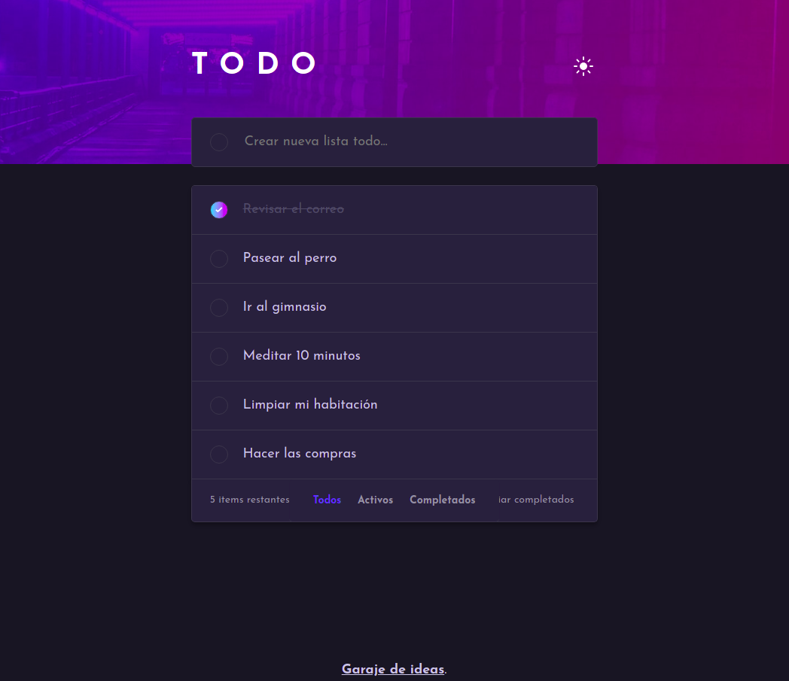

# Garaje de ideas - Prueba frontend

## Bienvenidos! 👋

El objetivo de esta prueba es desarrollar un todo app! Basicamente consiste en un listado de tareas las cuales iras cargando como pendientes y marcandolas a medida que uno las vaya completando.

Para programar esta app puedes utilizar el framework JavaScript que prefieras (Angular, Vue, React, LitElement, Svelte, etc...) o simplemente vanilla js. El fuerte de esta app se centra en sus funcionalidades, el diseño ya viene proporcionado aunque se puede modificar todo al gusto de cada uno. Hecharle un ojo a la clase ".todo__elem--checked" ;)

## Estructura de la prueba

Te proporcionamos una estructura base aunque puedes usar el CLI del framework que selecciones. Te recomendamos que eches un ojo a las diferentes carpetas y a lo que hay en cada una de ellas antes de empezar la prueba.

En la raiz de este repositorio encontrarás los ficheros `index.html` y `js/script.js` que es donde debes realizar el ejercicio.

Sientete libre de comenzar tu proyecto tomando este como base o haciendolo desde 0 y solo tomar los assets como imagens, fuentes, estilos, etc.

## Requerimientos funcionales

Los usuarios deben ser capaces de:

- Te pedimos que improvises una adapatación a tablet ( 768px de ancho ) y mobile ( 360px de ancho ) del diseño. Tienes libertad. El principal objetivos es que **las cosas se vean lo mejor posible y sobre todo que no haya elementos rotos**.
- Agregar nuevas tareas a la lista
- Poder marcar las tareas como completadas
- Eliminar todas las tareas 
- Filtrar las tareas por todas/activas/completadas
- Limpiar de la lista todas las tareas completadas
- Intercambiar entre modo "claro" y "oscuro"
- Persistir los cambios utilizando el "local storage"
- **Bonus**: Implementar la funcionalidad "Drag and drop" o "arrastrar y soltar" para reordenar las tareas de las listas

## Assets

Todas las imagenes necesarias para esta app se encuentran en la carpeta `/img`.

## Envianos tu solución

El desarrollo de esta prueba debe estar subido a un repositorio git. Junto a los archivos debes incluir uno llamado `README.md` donde nos detalles comentarios sobre como resolviste los requerimientos y los comandos probar la aplicación en caso de utilizar algun framework o CLI. El link del repositorio debes enviarlo por mail a:

Mail: maria.patino@garajedeideas.com

Asunto: Prueba técnica frontend - [Nombre y apellido]
